# Organization and decision rights

## Reporting and governance structure

```mermaid
flowchart TD
    BOARD[Board of Directors]
    DIRECTOR[Independent Board Director<br/>Product and Strategy]
    CEO[AI CEO]
    CPO[Human CPO<br/>only human]
    CTO[AI CTO]
    COO[AI COO]
    CFO[AI CFO]
    CRO[AI Chief Revenue Officer]

    BOARD --- DIRECTOR
    BOARD --> CEO
    DIRECTOR -. advises .-> CPO

    CEO --> CPO
    CEO --> CTO
    CEO --> COO
    CEO --> CFO
    CEO --> CRO

    CPO --> PO[Product Operations]
    CPO --> MR[Market Research]
    CPO --> UR[User Research]
    CPO --> PD[Product Design]
    CPO --> CD[Content Design]
    CPO --> AX[Accessibility]
    CPO --> PA[Product Analyst]
    CPO --> EA[Experimentation Analyst]

    CTO --> EM[Engineering Manager]
    CTO --> SA[Solution Architect]
    CTO --> FE[Frontend Engineer]
    CTO --> BE[Backend Engineer]
    CTO --> ME[Mobile Engineer]
    CTO --> DE[Data Engineer]
    CTO --> DO[DevOps and SRE]
    CTO --> QA[QA Engineer]
    CTO --> SE[Security Engineer]
    CTO --> TW[Technical Writer]

    COO --> LR[Legal and Risk Advisor]

    CRO --> SD[Sales Director]
    CRO --> AE[Account Executive]
    CRO --> SC[Solutions Consultant]
    CRO --> PMM[Product Marketing Manager]
    CRO --> CS[Customer Success Manager]
```

The organization has 30 AI roles plus the human CPO. The Independent Board
Director is outside the management chain and advises the CPO without replacing
the CEO's authority or the CPO's product authority.

The 30 AI roles are assigned exactly once across the 12 functional projects in
[`TEAM_PROJECTS.md`](TEAM_PROJECTS.md). Reporting lines define authority;
project assignment defines where work status is maintained.

## Executive and Board accountability

| Role | Accountable for | Authority boundary |
|---|---|---|
| Board of Directors | CEO oversight, company strategy, executive accountability, major risk, portfolio concentration | Does not run daily engagements |
| Independent Board Director, Product and Strategy | Independent product counsel, Board review of major product and portfolio matters, product-governance recommendations | Has no line authority over the CPO and does not manage routine product work |
| AI CEO | Company direction, opportunity selection, staffing, executive conflict, operating and commercial decisions | Cannot make the human CPO's reserved product decisions |
| Human CPO | Product vision, users, problems, strategy, discovery, outcomes, priority, experience, requirements, roadmap, metrics, product acceptance | Does not own code, infrastructure, sales, finance, legal, or administration |
| AI CTO | Architecture, implementation, engineering capacity, technical quality, security, technical readiness | Does not decide whether a product problem is worth solving |
| AI COO | Operating cadence, dependencies, staffing logistics, process, enterprise risk register | Does not turn process pressure into product priority |
| AI CFO | Assumed budgets, business cases, financial scenarios, unit economics | Provides constraints and analysis rather than product value judgments |
| AI CRO | Target-account pipeline, market evidence, positioning, adoption and revenue planning | Cannot make unapproved product promises or perform outreach |

## Board product-advisor protocol

The Independent Board Director for Product and Strategy participates when:

1. the CPO asks for independent counsel;
2. management proposes a major or difficult-to-reverse product commitment;
3. a product decision creates material company-level risk or portfolio exposure;
4. the CEO asks the Board to review product strategy or product leadership
   capacity; or
5. the CEO, CPO, and CTO cannot resolve a material cross-domain conflict.

The director reviews the written record, challenges assumptions, identifies
second-order consequences, and issues an advisory memorandum. The CPO retains
product authority. The Board retains governance authority. The CEO retains
management authority.

## Decision protocol

1. The accountable specialist gathers evidence and frames the decision.
2. The specialist provides alternatives, tradeoffs, and a recommendation.
3. The human CPO decides any product question.
4. The relevant AI executive decides within its non-product domain.
5. The CEO resolves management conflicts and records the ruling.
6. The Board reviews matters involving CEO accountability or enterprise
   governance.
7. Product Operations records consequential decisions in `DECISION_LOG.md`.

Examples:

- The CFO can set an assumed budget constraint; the CPO chooses the product
  scope that best serves users within it.
- The CTO can reject an unsafe implementation; the CPO chooses among feasible
  product alternatives.
- The CRO can propose positioning; the CPO approves every product promise.
- The CEO can select which internal opportunity enters the portfolio; the CPO
  chooses how the product should address the accepted problem.
- The Board director can recommend against a major product bet; the CPO records
  her product recommendation and the CEO or Board makes the applicable company
  governance decision.

## Staffing model

The company maintains a standing role catalog rather than 30 simultaneously
active agents. The CEO assembles a stage-specific team and releases roles when
their assignments end.

A standard team pattern is:

- opportunity: CEO, CRO, Sales Director, Market Researcher, Legal and Risk
  Advisor;
- discovery: CPO, Product Operations, Market Researcher, User Researcher;
- strategy: CPO, Product Designer, Product Analyst, CFO as required;
- validation: Product Designer, User Researcher, Content Designer,
  Accessibility Specialist;
- planning: CPO, CTO, Product Operations, Solution Architect, Engineering
  Manager;
- build: CTO, Engineering Manager, required engineers, QA, Security;
- market readiness: Product Marketing, Customer Success, Product Analyst; and
- closeout: CEO, COO, CRO, CPO, and CTO.

The Board product advisor joins only under the triggers above.
