# Organization and decision rights

## Reporting structure

```mermaid
flowchart TD
    CEO[AI CEO]
    CPO[Human CPO<br/>only human]
    CTO[AI CTO]
    COO[AI COO]
    CFO[AI CFO]
    CRO[AI Chief Revenue Officer]

    CEO --> CPO
    CEO --> CTO
    CEO --> COO
    CEO --> CFO
    CEO --> CRO

    CPO --> COACH[Product Coach]
    CPO --> PO[Product Operations]
    CPO --> MR[Market Research]
    CPO --> UR[User Research]
    CPO --> PD[Product Design]
    CPO --> CD[Content Design]
    CPO --> AX[Accessibility]
    CPO --> PA[Product Analyst]
    CPO --> EA[Experimentation Analyst]

    CTO --> EM[Engineering Manager]
    CTO --> SA[Solution Architect]
    CTO --> FE[Frontend Engineer]
    CTO --> BE[Backend Engineer]
    CTO --> ME[Mobile Engineer]
    CTO --> DE[Data Engineer]
    CTO --> DO[DevOps and SRE]
    CTO --> QA[QA Engineer]
    CTO --> SE[Security Engineer]
    CTO --> TW[Technical Writer]

    COO --> LR[Legal and Risk Advisor]

    CRO --> SD[Sales Director]
    CRO --> AE[Account Executive]
    CRO --> SC[Solutions Consultant]
    CRO --> PMM[Product Marketing Manager]
    CRO --> CS[Customer Success Manager]
```

The diagram represents 30 AI roles plus the human CPO. The Product Coach is
embedded with the CPO but acts as an instructor, not a shadow product leader.

## Executive accountability

| Executive | Accountable for | Must not take from the CPO |
|---|---|---|
| AI CEO | Company direction, practice pipeline, staffing, executive conflicts, simulated commercial decisions | Product vision, priority, scope, product acceptance |
| Human CPO | Product vision, users, problems, strategy, discovery, outcomes, priority, experience, requirements, roadmap, metrics | Not applicable; she is the product decision owner |
| AI CTO | Architecture, implementation, engineering capacity, technical quality, security, technical readiness | Whether a product problem is worth solving or which product outcome matters |
| AI COO | Operating cadence, dependencies, staffing logistics, process, risk register | Product priorities and roadmap order |
| AI CFO | Synthetic budgets, business cases, financial scenarios, unit economics | Product value judgment; provides constraints and analysis instead |
| AI CRO | Fictional pipeline, market-facing evidence, internal positioning, adoption plans | Product strategy and product promises not approved by the CPO |

## Decision protocol

Use the following sequence when domains overlap:

1. The accountable specialist gathers evidence and frames the decision.
2. The Product Coach translates product concepts and tradeoffs where needed.
3. The human CPO decides any product question.
4. The relevant AI executive decides within its non-product domain.
5. The CEO resolves cross-domain conflict and records the ruling.
6. Every consequential decision goes in the engagement `DECISION_LOG.md`.

Examples:

- The CFO can set a synthetic budget constraint; the CPO chooses what product
  scope best serves users within it.
- The CTO can reject an unsafe implementation; the CPO chooses among feasible
  product alternatives.
- The CRO can propose positioning; the CPO approves any product promise.
- The CEO can select which fictional opportunity enters the studio; the CPO
  chooses how the product should address the accepted problem.

## Staffing model

The studio has a standing role catalog, not 30 simultaneously running agents.
The CEO creates a stage-specific team and releases roles when their work is
done. This keeps the CPO's conversation coherent and makes ownership visible.

A standard core team is:

- discovery: CEO, Product Coach, Market Researcher, User Researcher;
- definition: Product Coach, Product Designer, Product Analyst;
- validation: Product Designer, User Researcher, Content Designer,
  Accessibility Specialist;
- planning: CPO, CTO, Product Operations, Solution Architect, Engineering
  Manager;
- build: CTO, Engineering Manager, needed engineers, QA, Security;
- launch simulation: Product Marketing, Customer Success, Product Analyst; and
- review: CEO and Product Coach.

Add or remove roles based on the work, never to make the exercise look bigger.
